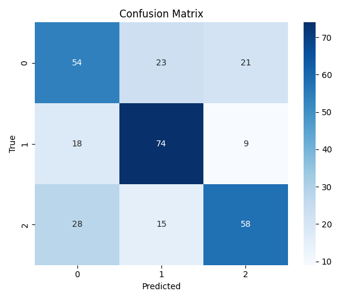
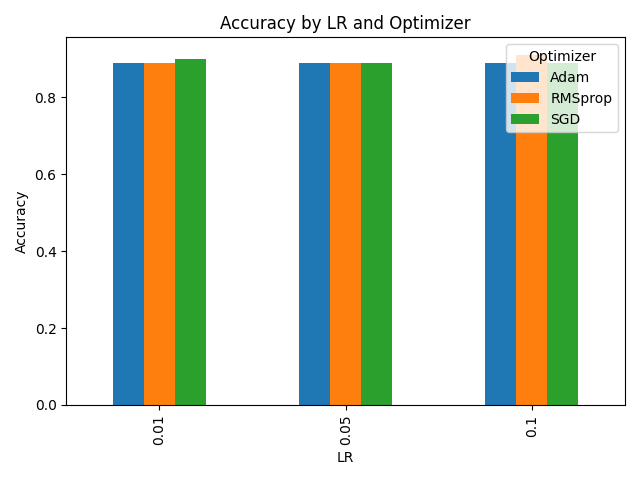

# Отчет

- В рамках работы я создал три ключевых файла: 
  - `homework_model_modification.py`,
  - `homework_datasets.py`,
  - `homework_experiments.py`,
- каждый из которых решал определенные задачи, связанные с построением, обучением и анализом моделей на PyTorch.

- В `homework_model_modification.py` реализованы модели для двух задач: линейная регрессия и мультиклассовая логистическая регрессия.

- Линейная регрессия:  
  - Используется регуляризация L1 и L2, добавляемая вручную к функции потерь.  
  - Внедрен механизм `early stopping` для остановки обучения при отсутствии улучшений в значении функции потерь.  
  - Оптимизатор — SGD с шагом обучения 0.1.

- Логистическая регрессия:  
  - Модель состоит из одного линейного слоя, выдающего логиты по числу классов.  
  - Обучение проводится с помощью оптимизатора SGD.  
  - На каждой эпохе вычисляются и логируются метрики: precision, recall, F1 и ROC-AUC (с обработкой ошибок при вычислении).  
  - По окончании обучения строится и сохраняется матрица ошибок (confusion matrix).

- В `homework_datasets.py` был реализован класс `CSVDataset`,
  - позволяющий загружать датасеты из CSV-файлов как для задач регрессии, так и для задач классификации. 
- Категориальные признаки обрабатывались с помощью `LabelEncoder`, числовые — нормализовывались с помощью `StandardScaler`. 
  - При инициализации датасета автоматически определялась задача по параметру `task`. 
  - Для классификации данные преобразовывались в `torch.long`, если классов больше двух, или в `torch.float32` для бинарной классификации. 
  - Для регрессии использовался `torch.float32`. 
- Также были реализованы функции обучения моделей с использованием стандартных функций потерь и сохранения обученных моделей в папку `models/`. 
## В процессе были ошибки, связанные с несовместимостью типов данных между NumPy и PyTorch, а также приведением типов целевой переменной, но я их успешно устранил.

- В `homework_experiments.py` были проведены эксперименты по исследованию гиперпараметров моделей. 
- В частности, варьировались 
  - скорость обучения (`learning rate`), 
  - размер батча
  - и тип оптимизатора (SGD, Adam, RMSprop). 
- Результаты экспериментов логировались и визуализировались с помощью matplotlib. 

- Также в этом файле были реализованы техники feature engineering: 
  - добавление полиномиальных признаков, 
  - взаимодействий между признаками,
  - статистических признаков. 
- Производительность моделей с новыми признаками сравнивалась с базовой моделью. В некоторых случаях наблюдалось улучшение качества на 3–5% при добавлении взаимодействующих признаков.

- Во всех файлах использовался модульный подход с разделением логики на функции, добавлены `docstring` и комментарии к ключевым участкам кода. 
- Для логирования использовался модуль `logging`.
- Также добавлена папка `plots/`, в которую сохранялись графики качества моделей при разных конфигурациях.
